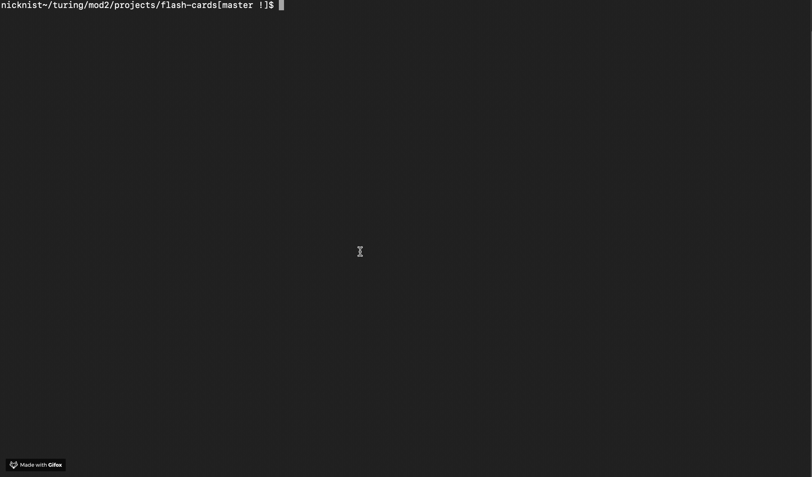

# FlashCards!

## Welcome to Flash Cards. The Fastest Game in the West.

### What is it?

Flash Cards is a fast-paced, timer-based, high intensity game. GET READY. There are 30 cards with 3 options for every question. 

### How does it look? 

Here's the start of the game in the command line:


Here's some Gameplay:

Here's how it ends and the message (Hit ctrl + C to exit the server):


### How Do I play?

* Once in the game. Use the arrow keys to move up and down, then hit enter when you've decided on your choice. 
* After you've been given feedback of correct or incorrect, hit enter to move onto the next question
* When you're finished, hit ctrl + c to leave the server and get back to the command line.


### Setup!

Clone down repo (from this GitHub). Since you don't want to name the game "flashcards-starter", you can use an optional argument when you run `git clone` (you replace the `[...]` with the terminal command arguments):

```bash
git clone [remote-address] [what you want to name the repo]
```

Once you have cloned the repo, change into the directory:

```bash
cd [whatever you named the directory]
```

Running `node index.js` from the root of the directory to start the game: 

```bash
node index.js
```
